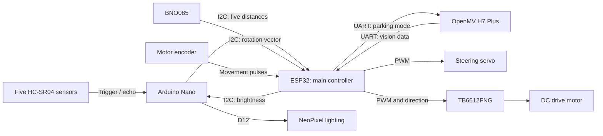
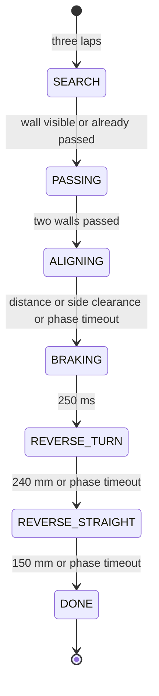

# Los-Grises-WRO-2026-MX

Official repository of Team Los Grises for the **Future Engineers - World Robot O1ympiad 2026**.
<div align="center">

</div>

## TEAM PHOTO


TEAM MEMBERS
---------
Coach:Eduardo Alvarado Gonzalez

Age:40

<div align="center"></div>


Role: Coach and founder.

"An engineer and professor founded the Los Grises Superiores in 2014, since then with outstanding national and international participations."


Name: Rodolfo Iván Sánchez Andaverde

Age: 14 years old

<div align="center"></div>

Role: Programmer

My journey in robotics began when I was very young; I started programming and building robots, and I always wanted to build more—I never got tired of it. I can tell you that I started when I was 9 years old, and when the opportunity arose to compete in the “Future Engineers” robotics competition, I didn’t want to miss out on it.


Name: Carlos Samuel Cortes Esteban

Age: 14

<div align="center"></div>

Role: Builder

Ever since I was a kid, robotics has always fascinated me, but it wasn’t until I started high school that I was able to really get into it. I joined the Advanced Curriculum Program (PCA), and that’s where I’ve been learning to code and build things. I also took some courses at Tec, and last summer I took the opportunity to continue learning at the Normal Superior. Little by little, what started as a childhood curiosity has turned into something I’m putting a lot of effort into.

Name:Christopher Pérez Cortés

Age: 14

<div align="center"></div>

Role:Programming & Electronics

Christopher joined the Robotics Club at Escuela Normal Superior "Profr. Moisés Sáenz Garza" earlier this year after completing an intensive robotics course. Currently in his third year of middle school, he has quickly developed skills in electronics, programming (Arduino C++), and 3D modeling (Onshape). WRO 2026 is his first international competition.


|COMPONENT| DESCRIPTION | IMAGE | PURCHASE LINK|
|---------|-------------|-------|--------------|
|IoT FireBeetle ESP32|FireBeetle ESP32: IoT board with Wi-Fi, Bluetooth, a lithium battery charging chip, and ultra-low power consumption (10 µA in standby mode).| <div align="center"></div> |[Buy here](https://www.amazon.com.mx/UEYGHEP-FireBeetle-Development-Bluetooth-habilitado/dp/B0GFDXH1XS)|
|Genuine OpenMV CAM H7 Plus / OpenMV4 CAM H7 Plus, 5MP|OpenMV H7 Plus: A 5 MP camera programmable in MicroPython for computer vision and AI (TensorFlow Lite), featuring a 480 MHz processor, 32 MB of SDRAM, and UART/I2C/SPI outputs for robotics.| <div align="center"></div> |[Buy here](https://www.amazon.com.mx/OpenMV-SingTown-Processing-Robotics-Detection/dp/B09WYQR6XH/ref=asc_df_B09WYQR6XH?mcid=d9e1cccb34dd3788899fe5c045006cbd&tag=gledskshopmx-20&linkCode=df0&hvadid=709953053678&hvpos=&hvnetw=g&hvrand=995950744755741935&hvpone=&hvptwo=&hvqmt=&hvdev=c&hvdvcmdl=&hvlocint=&hvlocphy=9138381&hvtargid=pla-1679372154675&psc=1&hvocijid=995950744755741935-B09WYQR6XH-&hvexpln=0&language=es_MX)|
|Micro SG90 9G Servomotor|SG90 Servo (9g): Compact, PWM-controlled actuator with a 180^\circ range, 1.8 kg·cm of torque at 5V, and plastic gears—ideal for lightweight robotics.| <div align="center"></div> |[Buy here](https://www.mercadolibre.com.mx/micro-servomotor-sg90-arduino-dhvk/p/MLM2072764647)|
|Mini Switch|Compact mechanical on/off (ON/OFF) or circuit-switching switch, ideal for controlling power or signals in electronics and robotics projects.| <div align="center"></div> |[Buy here](https://www.steren.com.mx/switch-miniatura-de-balancin-de-1-polo-1-tiro-2-posiciones.html?srsltid=AfmBOorFlYnUJpOq3Xbp_wxA4U4v6Ny5MNrUfvc4Dk4Rch1Ng-RLhhL7)|
|Mini Buck Converter (2 x 3.3V and 2 x 5V, |A compact step-down voltage regulator module that converts higher input voltages (6V–20V) into two 3.3V and two 5V fixed outputs simultaneously to power microcontrollers and sensors.| <div align="center"></div> |[Buy here](https://www.mercadolibre.com.mx/mini560-regulador-step-down-buck-520v-a-33v-5a/up/MLMU801699768?pdp_filters=item_id%3AMLM1524224577&from=gshop&matt_tool=96350334&matt_word=&matt_source=google&matt_campaign_id=23468835793&matt_ad_group_id=193272784204&matt_match_type=&matt_network=g&matt_device=c&matt_creative=793026290637&matt_keyword=&matt_ad_position=&matt_ad_type=pla&matt_merchant_id=138246593&matt_product_id=MLMU801699768&matt_product_partition_id=2499513569412&matt_target_id=pla-2499513569412&cq_src=google_ads&cq_cmp=23468835793&cq_net=g&cq_plt=gp&cq_med=pla&gad_source=1&gad_campaignid=23468835793&gbraid=0AAAAAoTLPrIkKV_I1WCO56AnykjGyPUd1&gclid=Cj0KCQjw5P7UBhDaARIsAOSlS1ObF_EZE4Nw20tx_y7MbgBdcKXDicX7Cxym7gSGnA_cG17Fos5-uYcaAlohEALw_wcB)|
|BNO080 — Nine-Axis Sensor Module (9DOF AHRS)|Nine-axis sensor module combining a 3-axis accelerometer, 3-axis gyroscope, and 3-axis magnetometer with an onboard ARM Cortex-M0+ running Hillcrest's SH-2 firmware. It performs onboard sensor fusion to output precise 3D orientation (quaternions, Euler angles) over I2C, SPI, or UART without burdening the main microcontroller.| <div align="center"></div> |[Buy here](https://www.amazon.com.mx/MerciL-BNO080-BNO085-Aceler%C3%B3metro-Magnet%C3%B3metro/dp/B0D676S54D/ref=asc_df_B0D676S54D?mcid=3696696f10443638bed02770ee6a4700&tag=gledskshopmx-20&linkCode=df0&hvadid=709846585818&hvpos=&hvnetw=g&hvrand=4418643876419025938&hvpone=&hvptwo=&hvqmt=&hvdev=c&hvdvcmdl=&hvlocint=&hvlocphy=9138381&hvtargid=pla-2383985741670&psc=1&hvocijid=4418643876419025938-B0D676S54D-&hvexpln=0&language=es_MX)|
|2-terminal terminal block|A screw or push-in connector module that allows secure, detachable wiring connections between power sources or components and a circuit board without soldering.| <div align="center"></div> |[Buy here](https://www.amazon.com.mx/BORNERA-CULCA-CLEMA-PAQUETE-PIEZAS/dp/B08MLGXP52/ref=asc_df_B08MLGXP52?mcid=48ca99af176d3db68a9f07b31390befa&tag=gledskshopmx-20&linkCode=df0&hvadid=776038187751&hvpos=&hvnetw=g&hvrand=11333659783582053295&hvpone=&hvptwo=&hvqmt=&hvdev=c&hvdvcmdl=&hvlocint=&hvlocphy=9138381&hvtargid=pla-2477907209270&psc=1&hvocijid=11333659783582053295-B08MLGXP52-&hvexpln=0&language=es_MX)|
|4×4 NeoPixel LED Square — RGB WS2812|A compact matrix of 16 individually addressable RGB LEDs that can display over 16 million colors using a single microcontroller data pin.| <div align="center"></div> |[Buy here](https://www.amazon.com.mx/bits-WS2812B-5050-M%C3%B3dulo-color/dp/B09T5XJP69)|
|7805 regulators|A linear regulator that steps down higher DC input voltages (7V–35V) to a stable, fixed 5V output at up to 1.5A.| <div align="center"></div> |[Buy here](https://www.mercadolibre.com.mx/50-pzs--7805--l7805-regulador-voltaje-5-volts/up/MLMU974457952?matt_tool=28238160&utm_source=google_shopping&utm_medium=organic&pdp_filters=item_id%3AMLM540229530&from=gshop)|
|Arduino Nano|A compact, breadboard-friendly microcontroller board based on the ATmega328P, running at 16 MHz with 32 KB Flash memory and an integrated USB port for easy programming.| <div align="center"></div> |[Buy here](https://www.amazon.com.mx/UNIT-ELECTRONICS-Cable-Compatible-Arduino/dp/B09MRFHR9C/ref=asc_df_B09MRFHR9C?mcid=6b9b023b93f03085b1d7a201be067697&tag=gledskshopmx-20&linkCode=df0&hvadid=709877922915&hvpos=&hvnetw=g&hvrand=10047845273782862886&hvpone=&hvptwo=&hvqmt=&hvdev=c&hvdvcmdl=&hvlocint=&hvlocphy=9138381&hvtargid=pla-1891307646614&psc=1&hvocijid=10047845273782862886-B09MRFHR9C-&hvexpln=0&language=es_MX)|
|TB6612FNG — Motor Driver|A dual H-bridge motor driver IC that can independently control speed (via PWM) and direction for two DC motors (up to 1.2A continuous per channel, 3.2A peak) or one stepper motor, offering high efficiency over traditional L298N drivers.| <div align="center"></div> |[Buy here](https://www.amazon.com.mx/SparkFun-TB6612FNG-driver-motor-cabezales/dp/B07PV1S8HX)|
|HC-SR04 — Ultrasonic Sensors|A non-contact distance measurement module using 40 kHz ultrasound waves to measure distances from 2 cm to 400 cm with ~3 mm accuracy.| <div align="center"></div> |[Buy here](https://www.steren.com.mx/sensor-ultrasonico.html?srsltid=AfmBOoogf1Gfv2SaGqfx9eksfESmp_9pOB4CRV0iXKpYIlHyzoZVnPMP)|
|Bridge Cables|Flexible insulated wires with pin connectors (male-to-male, female-to-female, or male-to-female) used to make quick, temporary electrical connections on breadboards, sensors, and development boards without soldering.| <div align="center"></div> |[Buy here](https://www.steren.com.mx/juego-de-80-cables-de-15-cm-tipo-dupont.html?srsltid=AfmBOorE01AG0GaIj7KATYeFa9BpvgRFR6KNob5AZWQ6hqlMbf-zBKgZ)|
|3.7V 18650 Batteries|A standard rechargeable lithium-ion cell (18 mm x 65 mm) providing a nominal voltage of 3.7V, widely used in robotics and portable devices for its high energy density and capacity.| <div align="center"></div> |[Buy here](https://www.mercadolibre.com.mx/2-piezas-pila-18650-37v-2200mah/up/MLMU479366103?pdp_filters=item_id%3AMLM1897814523&from=gshop&matt_tool=96350334&matt_word=&matt_source=google&matt_campaign_id=23468835793&matt_ad_group_id=193272784204&matt_match_type=&matt_network=g&matt_device=c&matt_creative=793026290637&matt_keyword=&matt_ad_position=&matt_ad_type=pla&matt_merchant_id=117929015&matt_product_id=MLMU479366103&matt_product_partition_id=2499513569412&matt_target_id=pla-2499513569412&cq_src=google_ads&cq_cmp=23468835793&cq_net=g&cq_plt=gp&cq_med=pla&gad_source=1&gad_campaignid=23468835793&gbraid=0AAAAAoTLPrIkKV_I1WCO56AnykjGyPUd1&gclid=Cj0KCQjw5P7UBhDaARIsAOSlS1OZOnnSEMnnw5iubuIqdwOLzjt2VbECDNOBlJnh_g_P9cEIhO3u2fwaAoMMEALw_wcB)|
|18650 Battery Holder|A plastic enclosure with metal spring contacts designed to hold one or more 18650 lithium-ion cells securely, providing lead wires or pins to safely connect battery power to a circuit board.| <div align="center"></div> |[Buy here](https://articulo.mercadolibre.com.mx/MLM-554243991-porta-pilas-baterias-18650-doble-para-dos-baterias-_JM?matt_tool=23496835&matt_word=&matt_source=google&matt_campaign_id=23459163732&matt_ad_group_id=192406232795&matt_match_type=&matt_network=g&matt_device=c&matt_creative=793141849433&matt_keyword=&matt_ad_position=&matt_ad_type=pla&matt_merchant_id=109113093&matt_product_id=MLM554243991&matt_product_partition_id=2496744657271&matt_target_id=pla-2496744657271&cq_src=google_ads&cq_cmp=23459163732&cq_net=g&cq_plt=gp&cq_med=pla&gad_source=1&gad_campaignid=23459163732&gbraid=0AAAAAoTLPrIbjMMy2UTIh14c5yX7TWlo4&gclid=Cj0KCQjw5P7UBhDaARIsAOSlS1ObgGFiTirrEp1Qe4ankOldtaXF8nlDjcCBdewaxhcb1XDTU8AICN0aAll9EALw_wcB)|
|GM25-370 6V 100 RPM Motor|A compact DC gear motor featuring a 25 mm diameter metal gearbox that produces high torque at low speed (100 RPM at 6V), commonly used in small mobile robots and drive mechanisms requiring precise motion.| <div align="center"></div> |[Buy here](https://www.amazon.com.mx/Motorreductor-GM-25-370-proyectos-mecatr%C3%B3nica/dp/B0FFPXGHCZ/ref=asc_df_B0FFPXGHCZ?mcid=03f933822e8434c5bfc36e6558496c71&tag=gledskshopmx-20&linkCode=df0&hvadid=709952720852&hvpos=&hvnetw=g&hvrand=7665342604280907245&hvpone=&hvptwo=&hvqmt=&hvdev=c&hvdvcmdl=&hvlocint=&hvlocphy=9138381&hvtargid=pla-2439642179500&hvocijid=7665342604280907245-B0FFPXGHCZ-&hvexpln=0&language=es_MX&th=1)|
|8-LED LED strips (8-LED NEOPIXEL WS2812 RGB Strip)|A flexible or rigid strip featuring eight individually addressable RGB LEDs, allowing full-color customization over a single digital data pin using integrated WS2812 drivers.| <div align="center"></div> |[Buy here](https://pigra.com.mx/optoelectronica/1260-tira-8-leds-neopixel-ws2812-rgb.html)|
|Logic Converters|A bidirectional module designed to safely shift voltage signals between different logic levels (typically 5V and 3.3V) on digital lines like I2C, SPI, or UART, preventing high-voltage microcontrollers from damaging sensitive lower-voltage components.| <div align="center"></div> |[Buy here](https://naylampmechatronics.com/conversores-ttl/67-conversor-de-nivel-logico-4ch-5v3v.html)|


## Robot Circuit Board (PCB)

<div align="center">
</div>

<div align="center">
</div>


## Robot Overview

Our robot follows a track using a steering servo and a DC drive motor. We use five ultrasonic sensors to measure wall distances, a BNO085 to track rotation, and an encoder to detect movement. For the Obstacle Challenge, an OpenMV camera also finds colored pillars and parking walls.

We have two programs for the ESP32, our main controller. In the **Open Challenge**, the robot follows the corridor, turns at corners and counts three laps before its final positioning maneuver. In the **Obstacle Challenge**, it passes red pillars on the right and green pillars on the left, then searches for the parking area after three laps.

Throughout this guide, motor percentages mean **PWM commands**, and servo angles mean **servo commands**. They are the settings we use to control motion, not measurements of road speed or wheel angle. Our recorded measurements are in [Testing and Calibration](#testing-and-calibration).

<!-- PENDING: confirm that the code, CAD, schematic and photographs correspond to the final competition robot. -->

## Robot Gallery

<table>
<tr>
  <th align="center">Front</th>
  <th align="center">Rear</th>
  <th align="center">Left</th>
</tr>

<tr>
  <td align="center" valign="middle">
    
  </td>
  <td align="center" valign="middle">
    
  </td>
  <td align="center" valign="middle">
    
  </td>
</tr>

<tr>
  <th align="center">Right</th>
  <th align="center">Top</th>
  <th align="center">Bottom</th>
</tr>

<tr>
  <td align="center" valign="middle">
    
  </td>
  <td align="center" valign="middle">
    
  </td>
  <td align="center" valign="middle">
    
  </td>
</tr>
</table>

## Challenge Videos

### Open Challenge

<!-- PENDING: add a public or unlisted YouTube link showing at least 30 seconds of autonomous Open Challenge driving. -->

### Obstacle Challenge

<!-- PENDING: add a public or unlisted YouTube link showing at least 30 seconds of autonomous Obstacle Challenge driving. -->


## Mechanical Design

We control propulsion and steering separately. A DC motor provides drive through the TB6612FNG motor driver, while a servo moves the steering linkage. This lets us reverse the motor without changing how we command the steering. Our component list names a **GM25-370 6V 100RPM motor** and an **SG90 servo**; the voltage and speed in the motor name are part ratings.

The [3D model](cad/Part%20Studio%201.3mf) contains the upper and lower bodies, a rear support, and left, right and central parts. It includes 24 mesh objects and uses **meters** as its unit. These shapes help show how the body and supports fit into the design.

We center the servo at **90°** and limit normal steering commands to **50–130°**. The challenge programs use different corrections within that range for following walls, turning corners and reversing.

<!-- PENDING: confirm final dimensions and weight; complete the steering-linkage/Ackermann geometry, driven-axle, wheel, transmission and assembly descriptions. -->

## Electronics and Power System

Our [electrical schematic](wiring/schematic.jpg), labelled **WRO 26 INDIA**, shows the FireBeetle ESP32 **DFR0478**, the Nano, camera, IMU and actuator connections. The TB6612FNG uses channel A for the drive motor. The ESP32 sends its speed command through PWM and selects direction through two digital signals.

<a href="wiring/schematic.jpg"></a>

The power circuit has an 18650 battery input, a switched **VM** branch for the motor, and Mini 560 buck-converter branches labelled **5+** and **3.3**. Separate 7805 regulator branches supply the servo and NeoPixel lighting. The drawing also shows common ground connections, a logic-level converter between 5 V and 3.3 V signal domains, and a **100 nF capacitor** across the motor terminals.

The [connection reference](docs/electronics.md) gives the pin assignments and power-net details. Our [component inventory](docs/components-original.docx) includes tools and duplicate parts as well as robot components, so its quantities describe our inventory rather than the number fitted to one robot.

<!-- PENDING: confirm installed quantities and the BNO080/BNO085 module identity; reconcile the battery arrangement, final I2C/power wiring and PCB revision before completing the assembly instructions. -->

## Sensor Architecture

### Five HC-SR04 ultrasonic sensors

We place sensors on both sides and at the front. The side readings help us follow the corridor and finish passing pillars; the front sensor helps us slow down and detect a wall before reversing.

| Sensor | Position | Nano trigger / echo | Use in navigation |
|---|---|---|---|
| S1 | Left, 90° | D2 / D3 | Left corridor distance; red-pillar side confirmation |
| S2 | Left, 25° | D4 / D5 | Left corridor distance, Open corner detection and red-pillar confirmation |
| S3 | Front | D6 / D7 | Corner proximity, slowdown and front-wall escape |
| S4 | Right, 25° | D8 / D9 | Right corridor distance, Open corner detection and green-pillar confirmation |
| S5 | Right, 90° | D10 / D11 | Right corridor distance; green-pillar side confirmation |

The Nano reads **S3 → S1 → S5 → S2 → S4**. We check the front first, then alternate sides and leave a **10 ms delay** after each reading to space out the ultrasonic pulses. Each new distance becomes available immediately.

The Nano sends distances in millimeters over I²C at address **0x08**. The ESP32 requests ten bytes: two for each sensor, in S1-to-S5 order. It requests an update every 20 ms, using the latest reading from each sensor; the sensors are read sequentially, not all at once.

We limit the range to **2,000 mm**. A missing echo is also sent as 2,000 mm, so that value can mean either a clear path beyond the range or no echo. The [Nano program](code/Nano_Sensores_I2C__1_/Nano_Sensores_I2C__1_.ino) contains the scan and message format.

### BNO085 and encoder

We use the BNO085's rotation-vector data to calculate **yaw**, the direction the robot is facing, and add up changes in rotation. We reject jumps greater than 90° between samples. This gives us the accumulated rotation used to count laps and guide Open's corner turns.

The encoder has A and B connections to **D5 and D9** on the ESP32. We count rising edges on channel A. In Open, these pulses confirm that the motor has started moving. In Obstacles, we also convert pulses to distance for collision recovery and parking.

The Obstacle program combines distance and heading into an X/Y position estimate. It uses the commanded motor direction for the sign of movement; channel B is not used to decode direction. This estimate does not directly steer the corridor controller.

### Camera and lighting

The **OpenMV H7 Plus** processes the image and sends object information to the ESP32. The Nano handles white NeoPixels on **D12** and receives brightness commands over I²C. Our Nano program is configured for **16 LEDs**.

## Software Architecture

The ESP32 brings the sensor information together and chooses the movement behavior. The Nano handles ultrasonic timing and lighting, while OpenMV handles image processing. This keeps their tasks separate from the main steering and drive logic.



The camera connections are used by the Obstacle program. Open follows the corridor without reading the camera. Power wiring and level conversion are shown in the schematic above.

| Controller / purpose | Source file |
|---|---|
| ESP32, Open Challenge | [ESP32_Open_Giro_90.ino](code/ESP32_Open_Giro_90/ESP32_Open_Giro_90.ino) |
| ESP32, Obstacle Challenge | [ESP32_Obstaculos_V2.ino](code/ESP32_Obstaculos_V2/ESP32_Obstaculos_V2.ino) |
| Arduino Nano, sensors and lights | [Nano_Sensores_I2C__1_.ino](code/Nano_Sensores_I2C__1_/Nano_Sensores_I2C__1_.ino) |
| OpenMV, vision | [color_corner.py](code/openmv/color_corner.py) |

We load one challenge sketch on the ESP32 at a time. The two sketches stay in separate folders; they are not combined into a single program.

## Open Challenge Strategy

Our Open sequence is:

**Start → confirm movement → follow the corridor → detect and turn a corner → update the lap count → repeat → final positioning.**

### Starting and following the corridor

We begin with a **45% motor command** and wait for **four encoder pulses within a 600 ms detection window**. Once movement is confirmed, we start the round timer and a **five-second acceleration ramp**. This keeps the start tied to actual movement instead of just switching on the electronics.

To follow the corridor, we compare the left and right distance sums:

`error = (S1 + S2) - (S4 + S5)`

A **PID controller** turns that error into a steering correction. The proportional term responds to the current error, the integral term builds up while an error remains, and the derivative term responds to how quickly it changes. Our Open gains are **Kp = 0.04, Ki = 0.001, Kd = 0.003**. We limit the integral contribution and filter the derivative so that they do not produce excessive corrections.

Steering starts with a reduced proportional gain. As a front or side wall gets closer, we increase the response and reduce the motor target. The normal target is **100%**, reducing toward **60%** near walls. Front-distance slowdown grows between **600 and 200 mm**. When front and side protection both request a slowdown, we use the lower target.

### Detecting and turning corners

We look for a change from a nearby wall to an opening at S2 or S4. A reading of **800 mm or less** arms that side. A later reading of **at least 1,250 mm**, while S3 is still at **800 mm or less**, becomes a corner candidate. We require three confirming polls before turning.

During the turn, we use the BNO085 to track a **90° change in rotation**, with a 2° completion tolerance. The steering correction is **35°** and the motor command is **55%**. We then center the servo briefly before returning to corridor PID. Once a course direction has been chosen, later corner detections follow that direction.

If a turn has not finished after **2.5 seconds**, or valid heading is lost during the turn, the robot stops rather than continuing the turn indefinitely.

### Front-wall protection and recovery

If **S3 reaches 150 mm or less**, we cut drive, center the steering and brake before reversing at **45%**. We keep steering centered during this escape and resume forward control when S3 reaches **250 mm**. If reverse motion does not clear the wall within **2.5 seconds**, the robot stops and waits.

The general distance-data timeout is **250 ms**. Heading-loss behavior depends on the current maneuver: a 90° turn and final heading adjustment have their own stop conditions. The current setting allows ordinary corridor movement without heading, so an IMU failure is not a universal motor stop.

### Counting laps and final positioning

After encoder-confirmed startup, we accumulate the BNO085's rotation. Each 360° contributes one lap; at **1,080° of absolute accumulated turn**, we begin final positioning. This is our internal lap counter, based on rotation rather than detection of every field section.

We keep normal control for **500 ms of effective commanded forward motion**. Braking and reverse-escape pauses do not count toward this interval. Then, if S3 is below **1,000 mm**, we reverse at **35%** while correcting heading toward ±1,080°. The adjustment ends at **1,100 mm** of front clearance, after a **five-second limit**, or on the relevant sensor failure. If no adjustment is needed, the robot stops directly.

## Obstacle Challenge Strategy

For this challenge, we follow the corridor until the camera finds a pillar. We guide the robot past it on the correct side, use the side sensors to finish the pass, and return to corridor control. After three accumulated laps, we switch to searching for the parking area.

### Passing on the correct side

- **Red pillar, ID 5:** pass on the right, leaving the pillar on our left.
- **Green pillar, ID 3:** pass on the left, leaving the pillar on our right.

We use corridor PID between pillars, with **Kp = 0.12, Ki = 0.0015, Kd = 0.006**. The normal motor target is **70%**, reducing toward **50%** near corners. The IMU counts rotation and supports the position estimate and parking-side choice; it does not directly steer this corridor PID.

### Camera control and pillar lock

When the camera finds a valid target, we **lock its color ID**. This keeps a passing maneuver focused on one pillar instead of switching targets with every image. The upper image region guides the approach. In the lower region, we increase the passing offset as the pillar appears closer to the bottom of the image.

When the robot gets very close, the pillar can leave the camera's view. After the locked pillar reaches the low ROI, we use the side ultrasonics to confirm it alongside the robot: **S1/S2 for red**, and **S4/S5 for green**. A distance of **300 mm or less** in two polls starts the final part of the pass, with a **20° wrap correction** and **35% motor target**.

We release the lock after both sensors on that side report at least **360 mm**, with repeated confirmation and a short clear hold. The wrap also has a time limit, because a wall beside the robot might never give a clear reading. If the old target disappears and a new color is repeatedly detected, the lock can switch to the new pillar.

We return steering gradually to the corridor target, at up to **45° per second**. When a front wall is close, corridor control takes over immediately so that a smooth transition does not delay a needed turn.

### Wall protection and collision recovery

While the camera is steering, a side-wall limiter reduces only the correction that points **toward** a close wall. It works between **300 and 130 mm**, cancelling steering toward that side at 130 mm and limiting the motor target to **45%**. This protects wall clearance, but also leaves less room to go around a pillar.

The front guard adds more steering correction when a pillar is close to a front wall. If S3 reaches **150 mm**, front-wall escape takes priority: we brake, center the servo and reverse until there is **250 mm** of clearance or the escape times out.

We also check whether the locked pillar's image enters the collision region. After **two confirming frames**, we brake and reverse **100 mm at 30%**, using encoder pulses to measure that distance. If the distance is not reached within **1.5 seconds**, we stop anyway. We wait for **three clear frames** before another attempt. This collision indication comes from the camera, not a contact switch.

During forward navigation, wall escape has priority over pillar tracking, followed by collision recovery and the normal camera/corridor behaviors. Parking entry uses its own sequence and limits, described below.

If camera data stops arriving for **500 ms** after communication has started, we release the pillar lock and return toward corridor control. Wall following can continue, but without current vision we cannot rely on the pillar-passing strategy.

## Computer Vision

We use OpenMV to find **red and green pillars**, **parking walls** and a small central sample of the black wall. It processes **320 × 240 RGB565 images** and sends detections to the ESP32 rather than sending full images.

### Color and shape

We find connected color regions, called **blobs**, using LAB thresholds. L represents lightness; A and B represent color axes. These are our active pillar ranges:

| Color | L min / max | A min / max | B min / max |
|---|---|---|---|
| Red | 20 / 55 | 31 / 71 | −19 / 43 |
| Green | 32 / 68 | −128 / −16 | −128 / 127 |

Color alone is not enough. Floor markings can also enter these ranges, so we check shape and how much of the bounding box is filled. A pillar must be taller than it is wide, with a height/width ratio of at least **1.20**, and fill at least **60%** of its box. We also check size and rotation.

Red and magenta overlapped under artificial light, so we use the red-range candidates for parking walls too, then separate them by shape. A wall must be wide, with width/height of at least **1.30**. We reject candidates cut by the top of the parking search region because a cropped pillar can look short and wide. The separate magenta thresholds are not active in this detection path.

### Regions of interest and object position

A **region of interest (ROI)** tells us which part of the image to use for a particular task.

| Region | `(x, y, width, height)` | Purpose |
|---|---|---|
| High | `(90, 100, 140, 40)` | Guide the approach to a pillar |
| Low | `(0, 140, 320, 100)` | Guide the close pass |
| Collision | `(120, 200, 80, 15)` | Check whether the selected reference corner enters the collision zone |
| Parking search | `(0, 70, 320, 170)` | Find wide wall shapes |

We track the **bottom-left corner of green pillars** and the **bottom-right corner of red pillars**. We normalize X to **−100…100**, while Y stays in pixels. Using the same reference corner in both high and low regions keeps the coordinate meaning consistent during the approach. These are image positions, not measured distances in millimeters.

If both colors are present, the camera selects the larger-area candidate, choosing green on a tie. The small central black-wall sample is reported for display; we do not use it to trigger turns.

### Communication and lighting

The camera sends ten comma-separated integers and a newline over **UART at 19,200 baud, 8N1**:

```text
ID,X,Y,AREA,ROI,COLLISION,BLACK_WALL,PARKING_VISIBLE,PARKING_X,PARKING_AREA
```

The ESP32 can send `P,1` or `P,0` to control parking detection. We currently keep detection enabled throughout the run, while the driving sequence waits until three laps to begin parking. The optional path-preview telemetry and overlay are disabled.

At camera startup, we allow a short automatic adjustment, then lock gain and white balance and use **30,000 µs exposure**. In Obstacles, near, far and parking brightness are all **50%**, keeping the light target the same as the robot changes tasks. Open starts with a 0% base and uses a 20% corner indicator.

## Parking Strategy

After three accumulated laps, we search for the parking walls, move alongside the gap and reverse into it in two stages. We use a **state machine** so that each stage has a clear job and a condition for moving to the next one.



- **SEARCH:** follow the corridor with a **50% speed cap** and a **10° steering bias** toward the parking side. The bias brings us closer to the side where we are looking for the gap.
- **PASSING:** reduce the cap to **45%** and count two walls. We require repeated visible and absent frames so that one flickering detection does not count as a wall passed.
- **ALIGNING:** advance **260 mm by encoder**, or until the side sensors confirm at least **300 mm** of clearance. A phase timeout also ends this advance, but we only continue into reverse if the parking side is known.
- **BRAKING:** stop for **250 ms** and preposition the steering.
- **REVERSE_TURN:** reverse at **32%**, using a **34° steering correction** with its sign chosen for the parking side, for **240 mm**.
- **REVERSE_STRAIGHT:** countersteer with a **26° correction**, still at **32%**, for **150 mm** to straighten the robot. The servo is not centered during this stage.
- **DONE:** stop the motor and center steering. The robot stays stopped.

At the start of parking, accumulated yaw normally selects the side: positive rotation is configured as counterclockwise and selects the right; negative selects the left. Camera X supplies a side only if one has not already been assigned. While parking, camera messages count walls without starting new pillar-lock or visual-collision actions.

Each reverse stage has a **six-second limit** as an alternative to its distance target. The whole sequence has a **70-second limit**, and **1.5 seconds without Nano data** aborts it. We have no rear-distance sensor, so we bound reverse motion with encoder distance and time. The ordinary 250 ms distance timeout is replaced by the parking timeout, and front-wall escape is suppressed during braking and reverse entry.

Reaching `DONE` means that the movement sequence ended, which can also happen after a phase timeout. It does not measure whether the robot is fully inside the bay and parallel to the wall; those are the checks needed when observing a parking attempt.

## Engineering Decisions and Improvements

Our control decisions connect the sensing and movement tasks. A smoother steering change is not always the best choice near a wall, and a newer camera reading can be more useful than processing every queued frame. The following choices explain how we handle these situations. More detail is in our [Engineering Journal](docs/engineering-journal.md).

### Giving ultrasonic readings time and keeping I²C responsive

We read the ultrasonics sequentially and alternate sides to space out their pulses. Publishing each result immediately lets the ESP32 use it without waiting for the other four sensors. The trade-off is that the five distances come from slightly different times.

For Obstacles, we reduced I²C from **100 to 50 kHz** to give the signals more settling time in the presence of electrical noise. Open remains at 100 kHz. We also limit I²C waiting and reinitialize the bus when the Nano stops responding. Slowing communication and retrying it are separate measures: one changes normal timing, while the other addresses a stalled connection.

### Staying with a pillar without following an old target

The pillar lock solves one problem but can create another: holding the old color too long can keep steering toward a pillar we have already passed. We combine the camera-to-ultrasonic handoff with side-clearance checks and time limits, and allow a repeatedly detected new color to replace a stale target. This balances finishing one pass with responding to the next pillar.

### Balancing smooth steering and wall clearance

We use a gradual return to corridor PID on clear sections, but allow an immediate return near a front wall. Smooth steering is useful until it delays a turn that needs to happen now.

A fixed **8°** front-guard correction was too small in a corner, so we changed it to grow from **8° to 20°** as the front distance decreases. The side-wall limiter handles a separate compromise: keeping farther from the wall can leave less clearance around the pillar.

### Tying motion to encoder pulses

We use encoder pulses to confirm startup before beginning the acceleration ramp. In Obstacles, we also cap startup output at the requested target: a behavior asking for 30% should not receive the 45% startup command.

For collision recovery, we reverse by a measured pulse count corresponding to **100 mm** and add a time limit in case the distance is not reached. The same pulse-to-distance conversion supports parking. This connects our encoder calibration to the maneuvers that need distance information.

### Recovering sensors and discarding old images

An IMU that fails to initialize should not be ignored for the rest of the run. The Obstacle program retries before and after the round timer starts, with longer intervals after startup because initialization can interrupt normal control. It also reinitializes after a prolonged loss of rotation data.

Camera messages can queue up while the ESP32 is busy. Steering from an old image would point toward an outdated pillar position, so we discard excess backlog and process a limited number of complete messages per loop. This leaves time for distance readings and steering updates, at the cost of skipping some camera frames.

### Using shape and steady lighting

When red and magenta overlapped under artificial light, we separated tall pillars from wide walls instead of relying only on color. We also lowered the wall width/height threshold from **1.50 to 1.30** because an oblique wall could fall close to the old limit.

An exposure of **10,000 µs** made the image too dark, so we use **30,000 µs**. We keep the same 50% lighting target through obstacle driving and parking, avoiding a light-target change just when the camera begins a different task.

## Testing and Calibration

### Encoder distance calibration

Our encoder calibration notes record two trials over one meter:

| Trial / calculation | Result |
|---|---|
| Test 1, 1 meter | **3,870 pulses** |
| Test 2, 1 meter | **3,988 pulses** |
| Average | **3,929 pulses/m** |
| Conversion | `1000.0 / 3929.0` ≈ **0.2545 mm/pulse** |

We multiply the pulse count by this conversion in the Obstacle program to calculate collision-recovery and parking distances. It also feeds the position estimate. Open uses pulses to confirm startup, without applying this distance conversion.

### Camera observations

Our vision notes describe parking-wall width/height ratios of approximately **2.0 front-on** and **1.5 at an oblique angle**. This explains the change to a 1.30 wall threshold. They also compare a solid pillar filling roughly **85% or more** of its box with a diagonal floor marking around **45%**, which supports using a density filter. These are approximate observations, not a detection-accuracy score.

PID gains, LAB thresholds and maneuver limits are settings, not experimental results. The [calibration record](tests/calibration.md) keeps the measurement notes and the separate track-time estimate together, with their context.

<!-- PENDING: add final-version Open and Obstacle run records or videos, including observed parking containment, alignment and contact with bay markers. -->

## CAD, PCB and Manufacturing

Use these files to inspect the mechanical parts, follow the connections and understand the board layout:

| Asset | Use |
|---|---|
| [Part Studio 1.3mf](cad/Part%20Studio%201.3mf) | View the 24 mesh objects for the body and supports. Check that the viewer respects the meter units. |
| [Electrical schematic](wiring/schematic.jpg) | Follow controller, sensor, actuator and power connections. |
| [PCB layout](pcb/layout.jpg) | View tracks, connectors and component footprints. |
| [Fabricated PCB photo](images/pcb-fabricated.jpeg) | See the unpopulated board before components are fitted. |
| [Component inventory](docs/components-original.docx) | Identify part names and view component photographs. |

<table>
<tr><th>PCB layout</th><th>Fabricated board</th></tr>
<tr>
<td><a href="pcb/layout.jpg"></a></td>
<td><a href="images/pcb-fabricated.jpeg"></a></td>
</tr>
</table>

The PCB files here are images for reading the layout and connections. Manufacturing a matching board requires the editable design and fabrication outputs. The 3MF contains part meshes rather than a parametric CAD history.

<!-- PENDING: add the PCB fabrication outputs and assembly instructions needed to reproduce the final mechanical and electronic build. -->

## Repository Structure

The main robot files and technical guides are organized as follows:

```text
README.md
code/
  ESP32_Open_Giro_90/ESP32_Open_Giro_90.ino
  ESP32_Obstaculos_V2/ESP32_Obstaculos_V2.ino
  Nano_Sensores_I2C__1_/Nano_Sensores_I2C__1_.ino
  openmv/color_corner.py
cad/Part Studio 1.3mf
pcb/layout.jpg
wiring/schematic.jpg
images/pcb-fabricated.jpeg
tests/calibration.md
docs/
  electronics.md
  engineering-journal.md
  components-original.docx
  references/
    future-engineers-2026-rules-es.pdf
    future-engineers-2026-rubric-es.pdf
```

## How to Reproduce the Robot

### Hardware and connections

Start with the [3D model](cad/Part%20Studio%201.3mf), [schematic](wiring/schematic.jpg), [component inventory](docs/components-original.docx) and [pin reference](docs/electronics.md). The model shows part geometry; the pin reference covers the five sensor pairs, motor driver, servo, encoder, I²C and camera UART. The inventory also contains duplicate parts and workshop tools.

### Programs and dependencies

Open the `.ino` file inside its matching sketch folder and select the challenge program for the ESP32. Upload the Nano sketch to the Nano separately. The ESP32 pin aliases follow the **FireBeetle DFR0478** layout, so the board definition matters when resolving names such as `D5` and `D6`.

The ESP32 sketches use `Wire`, `Adafruit_BNO08x`, `WiFi`, `WebServer` and `esp_arduino_version`. The Nano sketch uses `Wire` and `Adafruit_NeoPixel`. The ESP32 PWM setup contains separate branches for board-package versions below 3 and versions 3 or above.

Run `color_corner.py` on the OpenMV camera. It uses `sensor`, `time`, `micropython`, `machine.UART` and `binascii`/`ubinascii`, so it needs the OpenMV environment rather than desktop Python. Camera UART3 runs at **19,200 baud**; the ESP32 side uses **RX GPIO25 and TX GPIO26**.

### Preparing and checking the system

Before a run, use the sensor layout and calibration values in this guide to check the steering center, encoder conversion and camera settings against the hardware. The Nano should respond at **0x08** with ten bytes, and OpenMV should send the ten-field message described above.

The ESP32 serial monitor runs at **115,200 baud** and reports distances, movement states and faults. In Open, the electronics can stay powered while the motor-power switch is open; movement confirmation starts when encoder pulses arrive.

The dashboards are enabled in the current sketches for testing. For competition rounds, Wi-Fi must be disabled as required by the rules. The code has a dashboard-off setting that switches off Wi-Fi; the competition configuration still needs to be selected and checked before a run.

<!-- PENDING: record the tested board definitions, library/OpenMV firmware versions, exact upload and persistent startup steps, and confirm the final competition configuration with wireless disabled. -->
<!-- PENDING: confirm the submitted repository URL, required historical commits, event deadline and final version notes before submission. -->

## Meet the Team

| Photo | Name | Role / Contribution |
|---|---|---|
|  | Rodolfo Iván Sánchez Andaverde | Programmer |
|  | Carlos Samuel Cortes Esteban | Builder |
|  | Christopher Pérez Cortés | Programming & Electronics |
|  | Eduardo Alvarado Gonzalez | Coach and founder |
